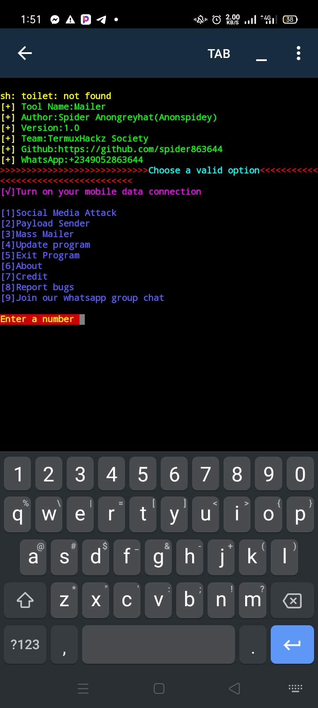
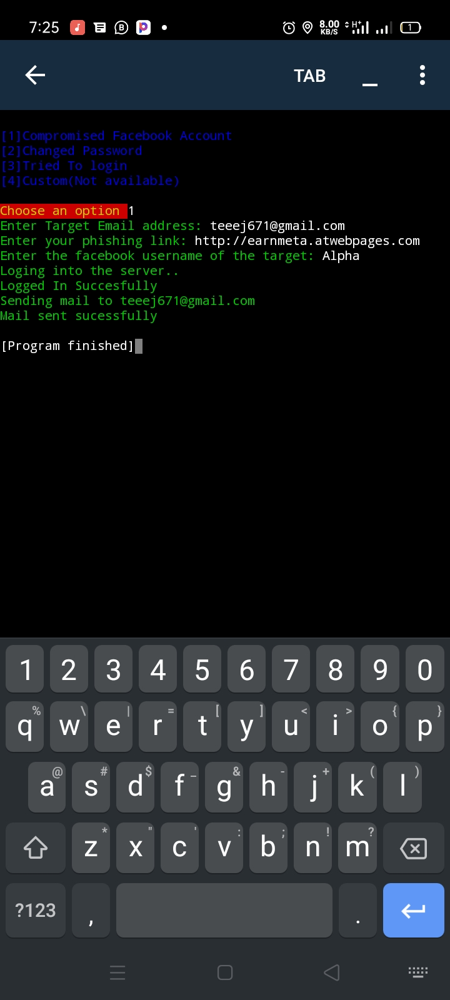

[](https://forthebadge.com)
# PhishingMailer
PS: Not the same as Phishmailer by BiZken but does the about the same.
Mailer is a social engineering toolkit.<br>It's used for sending spear-phishing to target email...created by spideranongreyhat


## Screenshots



## Installation for Termux

```
apt update
apt upgrade
apt install python3
apt install pip
pip install pyfiglet
apt install git
git clone https://github.com/spider863644/Mailer
cd Mailer
python3 mailer.py

```
## Installation for Linux

```
sudo apt update
sudo apt upgrade
sudo apt install python3
sudo apt install pip
sudo pip install pyfiglet
sudo apt install git
git clone https://github.com/spider863644/Mailer
cd Mailer
python3 mailer.py

```

## Instructions
1. Use a Facebook phishing link for Facebook attack
2. Only send mail to a email address linked to the social media you wanna attack
3. Use the victims valid username used on the social media you wanna attack
4. Always turn on your data 
5. Don't send mail to the wrong email


## Note:
For educational purposes only<br>
I won't be responsible for any shit<br>
<br>
Support me by following me on GitHub<br>
Don't forget to leave a star ⭐

