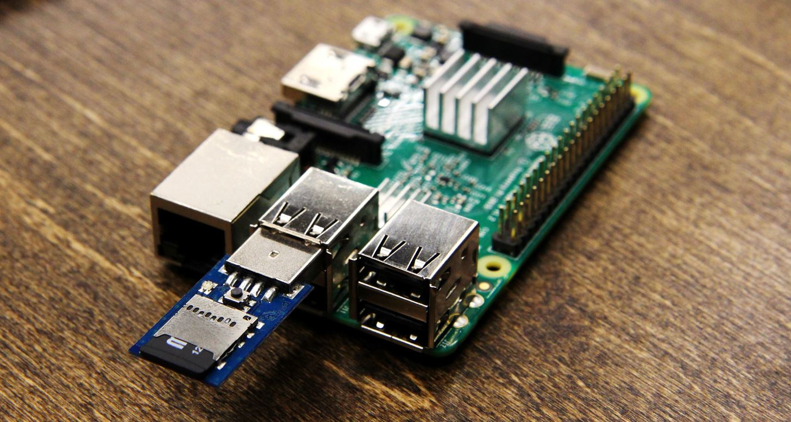

<h1 align="center"> 🦆 USB Rubber ducky/ O.MG Cable scripts 👌</h1>

 

#### USB Rubber ducky is an HID device that looks like any other USB drive. 
It can be used to 👇

    - inject keystroke into a system, 
    - used to hack a system, 
    - steal victims essential/credential data 
    - can inject payload to the victim's computers.
    - Can act as a reverse shell and install backdoors.
